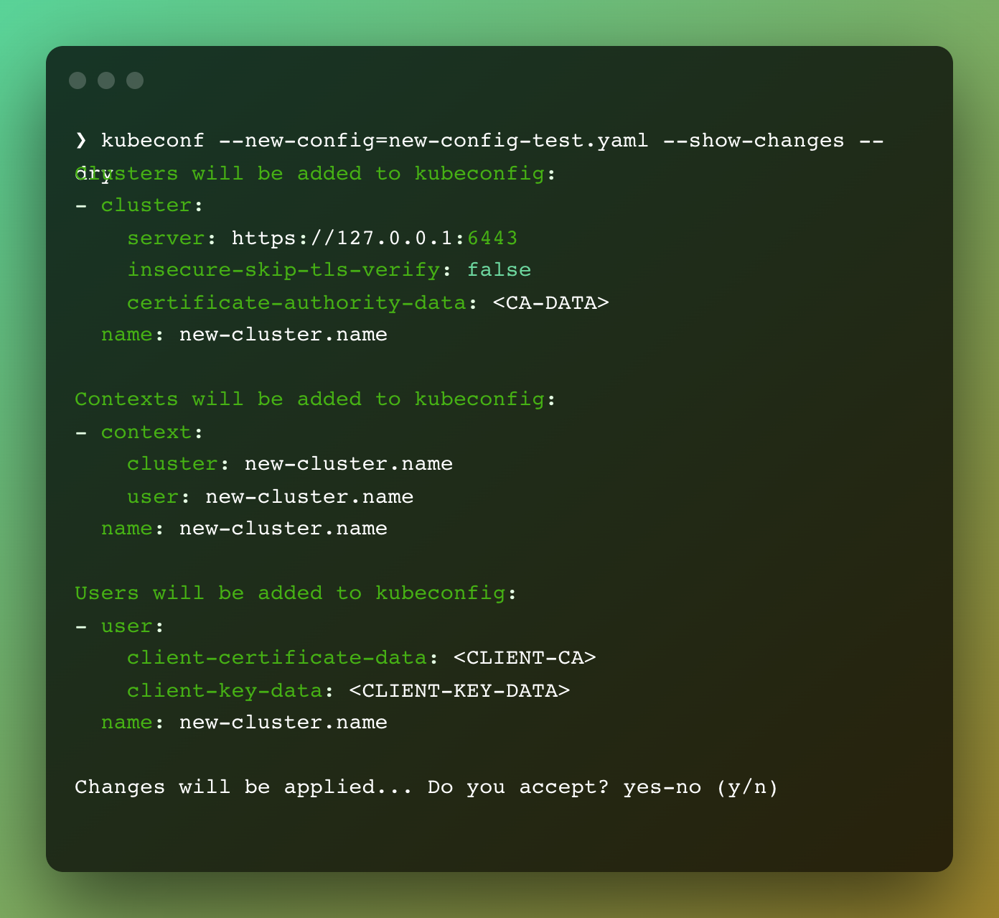

# kubeconf
A cli application to merge multiple config files into one kubeconfig or generate a new one.

# Usage

- Merge a new config file directly into /.kube/config:

`kubeconf merge --new-config=newConfig.yaml`

- Show what changes will be added to config file before persisting:

`kubeconf merge --new-config=newConfig.yaml --show-changes`

- Show changes without affecting existing config file:

`kubeconf merge --new-config=newConfig.yaml --show-changes --dry`

- To specify current config path:

`kubeconf merge --kubeconfig=/path/to/config --new-config=newConfig.yaml`

- Write output to another file:

`kubeconf merge --new-config=newConfig.yaml --output=output.yaml`
